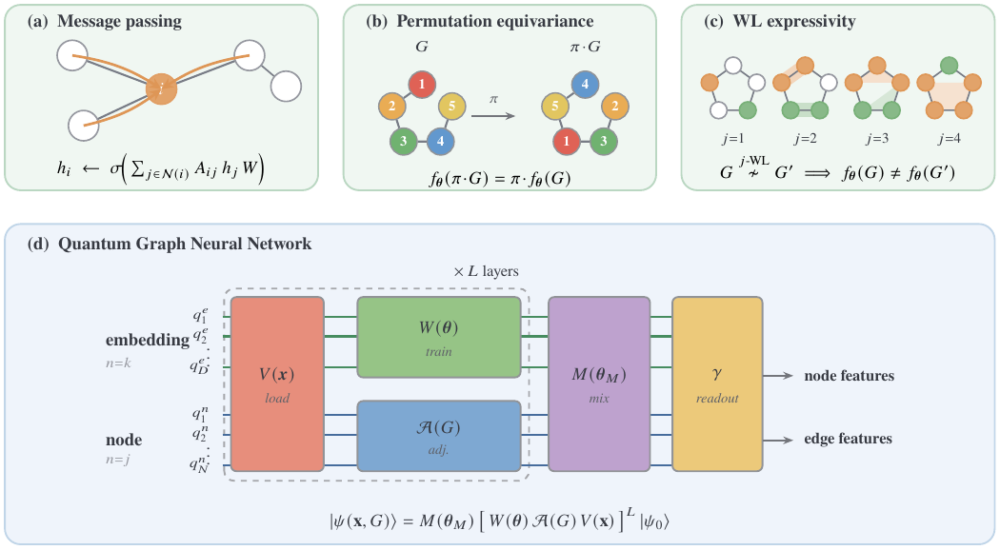
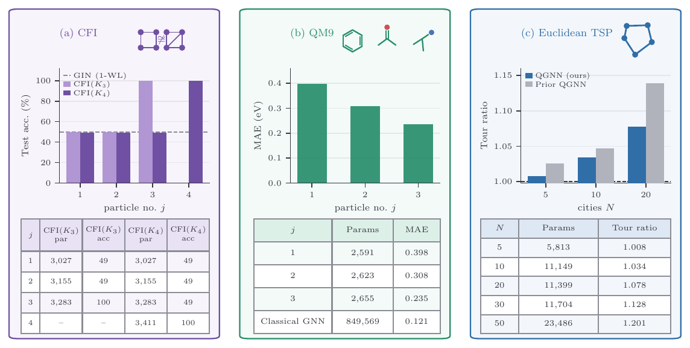

# Scalable Message-Passing Quantum Graph Neural Networks in the Weisfeiler–Leman Hierarchy

[](https://arxiv.org/abs/2606.26873)


Code for the paper [*Scalable Message-Passing Quantum Graph Neural Networks in the Weisfeiler–Leman Hierarchy*](https://arxiv.org/abs/2606.26873).
The model performs message passing, is permutation equivariant, and sits at a chosen level of the
Weisfeiler-Leman hierarchy. Both a PyTorch reduced-basis backend and a PennyLane circuit backend are
included and checked against each other to machine precision.

## Overview

Graphs are a natural language for relational data in chemistry, biology, and optimisation, and graph
neural networks learn from them through message passing, a single primitive that generalises
convolution and attention. Quantum counterparts have been proposed, but with limited connection to
message passing and few guarantees on performance or scalability. This work builds a quantum graph
neural network that performs message passing, is permutation equivariant, and sits at a chosen level
of the Weisfeiler-Leman hierarchy, the standard measure of how finely a model can tell graphs apart.
As for classical GNNs, training can be done first on small graph instances, which serves as a
pre-training that mitigates the usual trainability issues, and the output is read out at a cost that
stays low as the graph grows. The paper validates the framework in simulations of up to 56 qubits
across three datasets: synthetic graphs that ordinary message passing cannot separate, molecular
property prediction, and the travelling salesman problem.

## Method

The models share one Hamming-weight-preserving operation. A register of D qubits restricted to the
weight-k subspace carries C(D, k) amplitudes; a pyramid of two-qubit RBS gates acts on it as the
k-th compound of an orthogonal matrix. Working with that compound matrix lets the PyTorch model
evolve the C(D, k)-dimensional state directly, while the PennyLane circuit realises the same map on
qubits. For graph separation the node register is the weight-j subspace over the n vertices, and the
mixing is `exp(i * alpha * A_J)` with `A_J` the symmetric Johnson adjacency, which is the weight-j
block of the hopping Hamiltonian `H = sum_{a<b} (X_a X_b + Y_a Y_b) / 2`. Because `A_J` commutes with
vertex relabelling, the model is S_N-equivariant at every parameter value, and the node-register
particle number j sets the Weisfeiler-Leman level it reaches.



*Graph-learning properties (message passing, permutation equivariance, Weisfeiler-Leman expressivity)
and the two-register quantum model. A loader encodes the graph; a trainable evolution on the
embedding register and an equivariant adjacency on the node register alternate over L layers; a
mixing layer couples the registers and a readout returns node and edge features.*

## Installation

```bash
git clone https://github.com/SnehalRaj/mp-qgnns
cd mp-qgnns
pip install -e .
pytest            # 30 tests, ~30 s
```

PyTorch Geometric is required only for the real QM9 dataset; everything else runs on numpy, scipy,
torch, and pennylane.

## Reproducing the figures

Commands are indicative: they run the experiment behind each figure on a configuration that finishes
on a laptop. The large-N and full-dataset runs in the paper use the same scripts with larger sizes,
more seeds, and benchmark splits.



*Numerical validation across three tasks. (a) CFI separation: accuracy rises with the particle number
j and is perfect at the predicted level. (b) QM9 HOMO-LUMO gap error falls with j. (c) Euclidean TSP
tour ratio versus the number of cities.*

| Figure | What it shows | Reproduce |
|---|---|---|
| **Fig 1** | Framework: message passing, permutation equivariance, WL expressivity, and the two-register architecture | schematic (see Methods) |
| **Fig 2a** | CFI separation: accuracy rises with j and is perfect at the predicted level (j=3 for CFI(K3), j=4 for CFI(K4)); a 1-WL GIN stays at chance | `python experiments/run_cfi_climb.py --family k3 --model qgnn` |
| **Fig 2b** | QM9 HOMO-LUMO gap error falls monotonically with j | `python experiments/run_qm9.py --qm9-root data/QM9 --molecules 3000` |
| **Fig 2c** | Euclidean TSP tour ratio versus number of cities | `python experiments/run_tsp.py --train-split data/tsp10_train.pkl --test-split data/tsp10_test.pkl` |
| **Fig 3** | Equivariance improves data efficiency on TSP-5 | equivariance is verified in `pytest tests/test_invariance.py`; compare the equivariant model against a symmetry-broken arm |
| **Fig 4** | Polynomial gradient variance: no barren plateau | `python experiments/run_trainability.py` |
| **Fig 5** | Measurement-shot cost of each readout strategy | analysis (see Methods) |

Supporting checks:

```bash
python experiments/run_wl_ground_truth.py        # exact set-j-WL thresholds (K3 -> 3, K4 -> 4)
pytest tests/test_backend_equiv.py tests/test_compound_backend.py   # PennyLane == PyTorch
```

The quantum model is simulated in the weight-j subspace, so CFI(K3) (n=18, 816 subsets) runs on a
laptop. At n=40 the subspace has C(40, 4) = 91,390 states; CFI(K4) is reported with the classical
Johnson-GIN, which has the same set-j-WL distinguishing power. Representative CFI(K3) output (five
seeds, `--model qgnn`):

```
  j       test acc   invariance
  1   0.465 +/- 0.073      0.0e+00
  2   0.465 +/- 0.073      0.0e+00
  3   1.000 +/- 0.000      5.6e-03
```

## Data

The certified CFI gadgets (`data/cfi_gadgets.json`) and the synthetic graph pairs and molecules are
included or generated in code. Larger sets are produced or downloaded rather than shipped:
`experiments/generate_tsp.py` writes TSP splits with exact optimal tours, and `--qm9-root` downloads
QM9 through PyTorch Geometric on first use. The run scripts accept `--synthetic` (QM9) and random
instances (TSP) so the pipelines run without any download.

## Repository structure

```
src/mp_qgnns/
  core/        subsets and iso-type features, exact set-j-WL, compound-pyramid layer, PennyLane circuits
  models/      cfi (EquivariantQGNN, JohnsonGIN, GIN), tsp, qm9
  data_io/     CFI gadgets and synthetic pairs, TSP instances, QM9 molecules
  training/    CFI readout and evaluation, TSP training and decoding, QM9 regression
  trainability.py   gradient-variance probe
experiments/   one script per figure, plus generate_tsp.py
tests/         exact-WL, invariance, the climb, TSP, QM9, trainability, backend equivalence
data/          cfi_gadgets.json
```

## Citation

```bibtex
@article{mp-qgnns,
  title         = {Scalable Message-Passing Quantum Graph Neural Networks in the Weisfeiler–Leman Hierarchy},
  author        = {Raj, Snehal and others},
  year          = {2026},
  eprint        = {2606.26873},
  archivePrefix = {arXiv},
  primaryClass  = {quant-ph}
}
```

## License

MIT. See [LICENSE](LICENSE).
